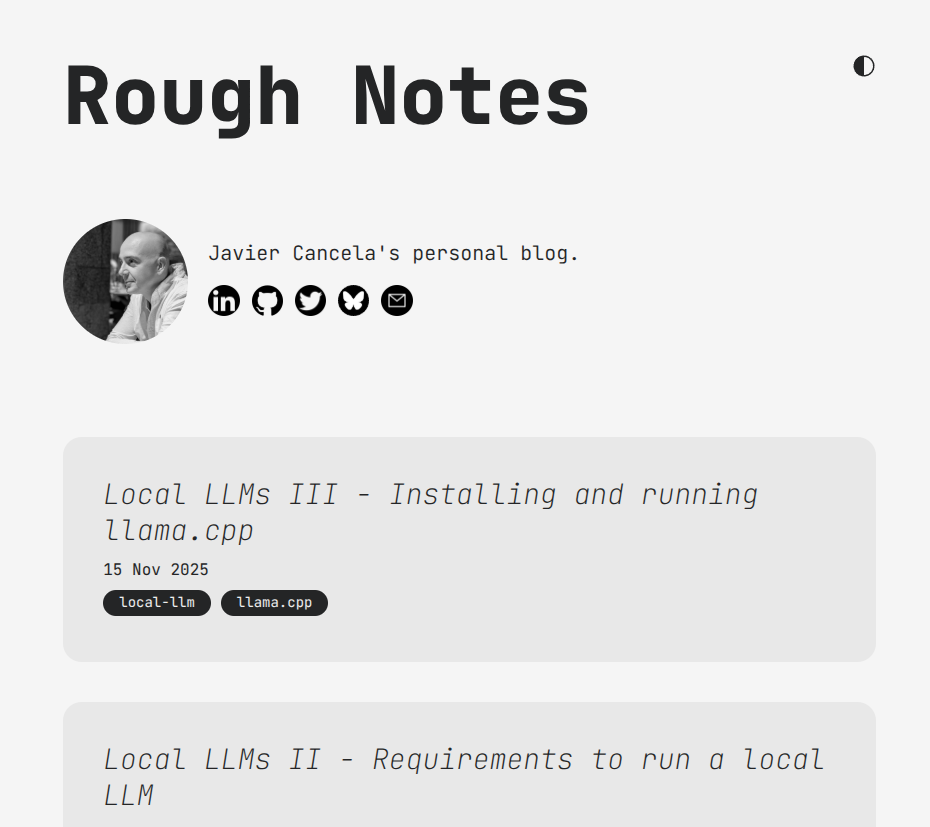
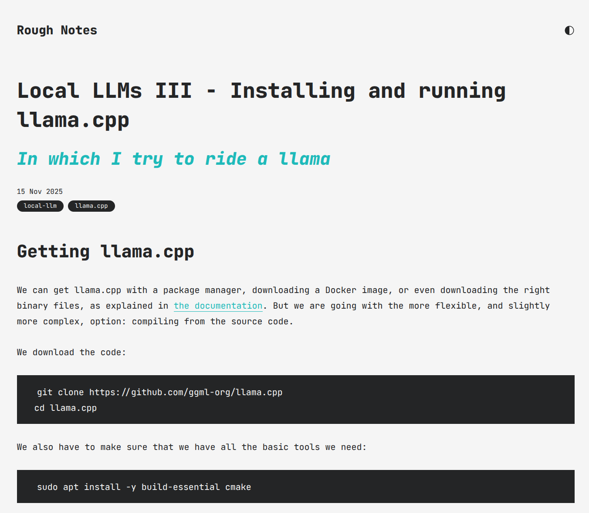

# I'm tired of my blog design

I like that it is simple, but it feels too.. big? Rough? The content is rough, but the design doesn't have to.

<figure>
  
  <figcaption>My blog before the redesign</figcaption>
</figure> 
<figure>
  
  <figcaption>Everything looks too big!</figcaption>
</figure> 
