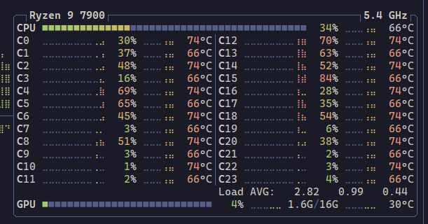

I want to run local models in my PC, and I want to do it while learning as much as possible in the process. What do I need do so?

# 1. The model

To run a model we need the model itself. This will be a file, or a set of files, detailing the structure of the model (layers, sizes, types) as well as the values of the model. Also, some metadata with information about the model.

There are different formats to pack a model and distribute it: GGUF is the most common, but there are several different options, some of which are described in [this Hugging Face article](https://huggingface.co/blog/ngxson/common-ai-model-formats).

## 1.1. Quantization

The size of a model is determined by its number of [trainable parameters](https://www.ibm.com/think/topics/llm-parameters). A typical open-weights model suitable to run on a personal PC has a few billion parameters. For example, [`Qwen/Qwen2.5-7B-Instruct`](https://huggingface.co/Qwen/Qwen2.5-7B-Instruct) has 7 billion (that's the 7B part, altough technically it has 7.61B). This model [uses 16-bit floating point numbers](https://huggingface.co/Qwen/Qwen2.5-7B-Instruct/blob/main/model.safetensors.index.json), so 2 bytes per parameter mean the model size is 15.2GB. All this data has be load in memory, ideally into the GPU VRAM. (As a reference, state of the art commercial LLMs like GPT-5 likely have trillions of parameters.)

To make it easier to fit tihs models in consumer-level GPUs, these parameters can be [quantized](https://huggingface.co/docs/optimum/en/concept_guides/quantization): we reduce the precision of the parameters to make the model smaller at the expense of some accuracy.

The GGUF format usually include several different quantized versions inside the same model file. For example, [this GGUF version](https://huggingface.co/models?other=base_model:quantized:Qwen/Qwen2.5-7B-Instruct) of `Qwen/Qwen2.5-7B-Instruct` contains quantizations ranging from 8 bits (8.1 GB) to 2 bits (3.02 GB).

## 1.2. Tensors

Parameters in a neural network are represented as tensors. We can think of tensors as the general term scalars, vectors, matrices, and groups of numbers of more than 2 dimensions. So running inference with a model is just adding and multiplying tensors. Adding and multiplying tensors is [conceptually very simple](https://betterexplained.com/articles/matrix-multiplication/), but computationally very expensive. GPUs are way more capable of doing this than CPUs because they can parallelize the floating point operations needed. Optimizing this operations is the key aspect of all this set-up. Generating a few tokens per second requires billions of operations per second, so any minimal improvement may be significant.

The GPU itself doesn't know about tensors, tough. It just know how to operate with floating point numbers with a lot of parallelism. So GPU manufacturers create software with different levels of abstraction to make it easier to run this pieces of hardware. For example, NVIDIA has [CUDA](https://developer.nvidia.com/cuda-toolkit), that lets you easily do math in parallel; [cuBLAS](https://developer.nvidia.com/cublas), that uses CUDA to expose an algebra-oriented API; and also [TensorRT](https://developer.nvidia.com/tensorrt), an SDK specialized in deep learning inference, which in turn uses cuBLAS.

# 2. The inference library

At the most basic level, an LLM model is an algorithm that gets some texts and returns some other text. The model includes a layer, usually the first one, to convert the text into numbers. These numbers are then processed by the rest of the layers, and the result is converted to text. This whole process is called [inference](https://huggingface.co/blog/Kseniase/inference). All the billions of parameters we saw before are applied in different ways to the input data to generate the result.

The inference library contains the code to execute all these operations. We have several options, let's review the most common ones.

### 2.1. llama.cpp

Probable the most popular one, llama.cpp

 There are several options to run local models in a PC: [LM Studio](https://lmstudio.ai/) is a non-Open Source tool with a full-fledged UI to maximize convenience. [Open WebUI](https://openwebui.com/) is and open-source alternative to LM Studio, as it is [Text Generation Web UI](https://openwebui.com/). One of the most popular options is [Ollama](https://ollama.com/), a command-line tool that

# Install llama.cpp
Install homebrew
Install llama.cpp
Install pip install -U "huggingface_hub[cli]"
hf download google/gemma-2-2b-it --local-dir ./gemma-2-2b-it
hf download bartowski/gemma-2-2b-it-GGUF --local-dir ./gemma-2-2b-it-GGUF (already converted)
llama-cli -m ./gemma-2-2b-it-GGUF/gemma-2-2b-it-Q4_K_M.gguf
 brew uninstall llama.cpp

# Toolchain
sudo apt update
sudo apt install -y build-essential cmake git

# (CUDA build only) NVIDIA + CUDA Toolkit
# If you already have the toolkit via Ubuntu repos/NVIDIA .run, you can skip this.
# Verify later with: nvcc --version

git clone https://github.com/ggerganov/llama.cpp.git
cd llama.cpp

 sudo apt install nvidia-cuda-toolkit --> NO! Have to uninstall later

# Make sure CUDA is visible
nvcc --version   # just to confirm CUDA is installed

# Build
cmake -S . -B build-cuda \
  -DCMAKE_BUILD_TYPE=Release \
  -DLLAMA_CUBLAS=1 \
  -DCMAKE_C_FLAGS_RELEASE="-O3 -march=native -mtune=native" \
  -DCMAKE_CXX_FLAGS_RELEASE="-O3 -march=native -mtune=native"

cmake --build build-cuda -j

ERROR:
│-- Found Git: /usr/bin/git (found version "2.48.1")                                                                                                                                                                                                                                   │
│CMake Error at CMakeLists.txt:126 (message):                                                                                                                                                                                                                                          │
│  LLAMA_CUBLAS is deprecated and will be removed in the future.                                                                                                                                                                                                                       │
│                                                                                                                                                                                                                                                                                      │
│  Use GGML_CUDA instead                                                                                                                                                                                                                                                               │
│                                                                                                                                                                                                                                                                                      │
│Call Stack (most recent call first):                                                                                                                                                                                                                                                  │
│  CMakeLists.txt:131 (llama_option_depr)                                                                                                                                                                                                                                              │
│                                                                                                                                                                                                                                                                                      │
│                                                                                                                                                                                                                                                                                      │
│-- Configuring incomplete, errors occurred!

# Let's install CUDA from NVIDIA, version 13 instead of 12
wget https://developer.download.nvidia.com/compute/cuda/repos/ubuntu2404/x86_64/cuda-ubuntu2404.pin
sudo mv cuda-ubuntu2404.pin /etc/apt/preferences.d/cuda-repository-pin-600
wget https://developer.download.nvidia.com/compute/cuda/13.0.1/local_installers/cuda-repo-ubuntu2404-13-0-local_13.0.1-580.82.07-1_amd64.deb
sudo dpkg -i cuda-repo-ubuntu2404-13-0-local_13.0.1-580.82.07-1_amd64.deb
sudo cp /var/cuda-repo-ubuntu2404-13-0-local/cuda-*-keyring.gpg /usr/share/keyrings/
sudo apt-get update
sudo apt-get -y install cuda-toolkit-13-0

cmake -B build -DGGML_CUDA=ON
cmake --build build --config Release
# -DCMAKE_CUDA_ARCHITECTURES="120"
# Review https://github.com/ggml-org/llama.cpp/blob/master/docs/build.md#runtime-cuda-environmental-variables
GGML_CUDA_ENABLE_UNIFIED_MEMORY=1?

error with cmake -B build

-- The C compiler identification is GNU 14.2.0 -- The CXX compiler identification is GNU 14.2.0 -- Detecting C compiler ABI info -- Detecting C compiler ABI info - done -- Check for working C compiler: /usr/bin/cc - skipped -- Detecting C compile features -- Detecting C compile features - done -- Detecting CXX compiler ABI info -- Detecting CXX compiler ABI info - done -- Check for working CXX compiler: /usr/bin/c++ - skipped -- Detecting CXX compile features -- Detecting CXX compile features - done CMAKE_BUILD_TYPE=Release -- Found Git: /usr/bin/git (found version "2.48.1") -- The ASM compiler identification is GNU -- Found assembler: /usr/bin/cc -- Performing Test CMAKE_HAVE_LIBC_PTHREAD -- Performing Test CMAKE_HAVE_LIBC_PTHREAD - Success -- Found Threads: TRUE -- ccache found, compilation results will be cached. Disable with GGML_CCACHE=OFF. -- CMAKE_SYSTEM_PROCESSOR: x86_64 -- GGML_SYSTEM_ARCH: x86 -- Including CPU backend -- Found OpenMP_C: -fopenmp (found version "4.5") -- Found OpenMP_CXX: -fopenmp (found version "4.5") -- Found OpenMP: TRUE (found version "4.5") -- x86 detected -- Adding CPU backend variant ggml-cpu: -march=native -- ggml version: 0.9.4 -- ggml commit: 132d6735 -- Could NOT find CURL (missing: CURL_LIBRARY CURL_INCLUDE_DIR) CMake Error at common/CMakeLists.txt:85 (message): Could NOT find CURL. Hint: to disable this feature, set -DLLAMA_CURL=OFF

we run
sudo apt update
sudo apt install libcurl4-openssl-dev

I get this error: CMAKE_BUILD_TYPE=Release -- ccache found, compilation results will be cached. Disable with GGML_CCACHE=OFF. -- CMAKE_SYSTEM_PROCESSOR: x86_64 -- GGML_SYSTEM_ARCH: x86 -- Including CPU backend -- x86 detected -- Adding CPU backend variant ggml-cpu: -march=native -- Found CUDAToolkit: /usr/local/cuda/targets/x86_64-linux/include (found version "13.0.88") -- CUDA Toolkit found -- Using CUDA architectures: native -- The CUDA compiler identification is unknown CMake Error at ggml/src/ggml-cuda/CMakeLists.txt:41 (enable_language): No CMAKE_CUDA_COMPILER could be found. Tell CMake where to find the compiler by setting either the environment variable "CUDACXX" or the CMake cache entry CMAKE_CUDA_COMPILER to the full path to the compiler, or to the compiler name if it is in the PATH. -- Configuring incomplete, errors occurred!

Reason: nvcc not found

If finally install
sudo apt install nvidia-cuda-toolkit -> No!!

and now I have nvcc :shrug:

The build works!
CMAKE_BUILD_TYPE=Release
-- ccache found, compilation results will be cached. Disable with GGML_CCACHE=OFF.
-- CMAKE_SYSTEM_PROCESSOR: x86_64
-- GGML_SYSTEM_ARCH: x86
-- Including CPU backend
-- x86 detected
-- Adding CPU backend variant ggml-cpu: -march=native
-- CUDA Toolkit found
-- Using CUDA architectures: native
-- The CUDA compiler identification is NVIDIA 12.2.140 with host compiler GNU 12.4.0
-- Detecting CUDA compiler ABI info
-- Detecting CUDA compiler ABI info - done
-- Check for working CUDA compiler: /usr/bin/nvcc - skipped
-- Detecting CUDA compile features
-- Detecting CUDA compile features - done
-- CUDA host compiler is GNU 12.4.0
-- Including CUDA backend
-- ggml version: 0.9.4
-- ggml commit:  132d6735
-- Found CURL: /usr/lib/x86_64-linux-gnu/libcurl.so (found version "8.12.1")
-- Configuring done (3.8s)
-- Generating done (0.1s)
-- Build files have been written to: /home/xavi/llms/llama.cpp/llama.cpp/build

nvcc is in /usr/local/cuda-13.0/bin
adding it to the path doesn't work, I had to create a symbolic link to /usr/bin/nvcc

what makes the trick is the following environment variable:
CUDACXX=/usr/local/cuda-13.0/nvcc

I tried
cmake --build build --config Release -j 8 and it is way faster than
cmake --build build --config Release

<figure>
  
  <figcaption>TODO-CAPTION</figcaption>
</figure> 
